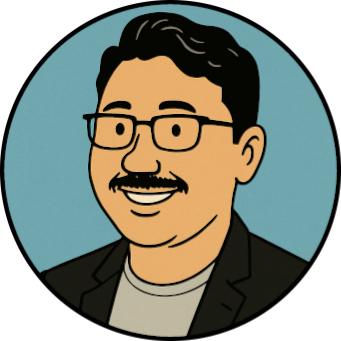

{fig-alt="Satrio Adi Rukmono." fig-align="left" width=200}

Welcome to my home page.

I am a lecturer at the [Knowledge & Software Engineering research group](https://stei.itb.ac.id/kk/rplp/), [Institut Teknologi Bandung](https://itb.ac.id/).

I did my PhD at the [Software Engineering & Technology group](https://set.win.tue.nl/research/), [TU Eindhoven](https://tue.nl/) on automated software architecture explanation. I received my master's degree from the [Informatics program](https://stei.itb.ac.id/en/education/master-informatics/), Institut Teknologi Bandung.

My academic parents are [prof.dr. Michel Chaudron](https://www.linkedin.com/in/michelchaudron/) and [dr. Lina Ochoa](https://www.linkedin.com/in/lina-ochoa-0b1ab73a/).

Email me at `sar` at the domain `itb.ac.id` (for teaching- and research-related matters) or `satrio` at the domain `rukmono.id` (for other things). You can also find me on [GitHub](https://github.com/rsatrioadi).

Feel free to browse around!