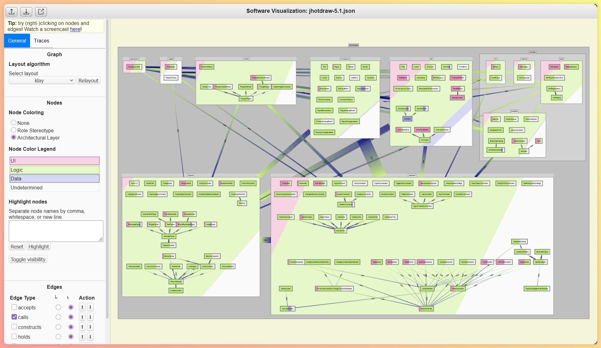

## ClassViz

[[Launch↗]](https://satrio.rukmono.id/classviz) Visualize your source code. Requires graph extractors (e.g., [Javapers](software.html#javapers) for Java or [Csharpers](software.html#chsarpers) for C#) to generate a JSON file as input for ClassViz, and optionally [Arcana](software.html#arcana) for enrichment.

{fig-alt="ClassViz screenshot." fig-align="left" width=600}

## Javapers

[[Code↗]](https://github.com/rsatrioadi/javapers)

## Csharpers

[[Code↗]](https://github.com/rsatrioadi/csharpers)

## Arcana

[[Code↗]](https://github.com/rsatrioadi/arcana)
